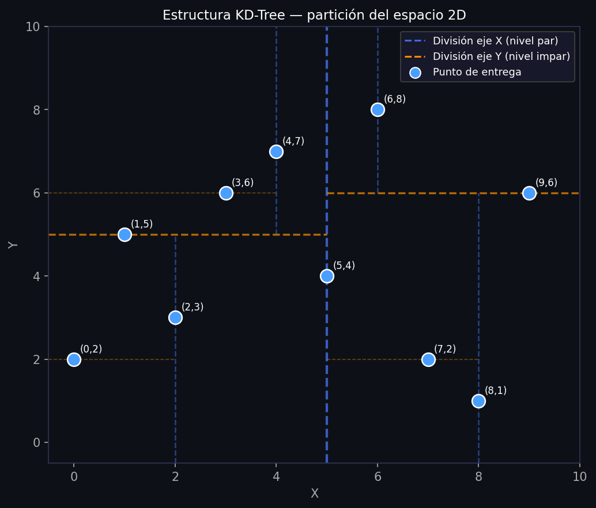
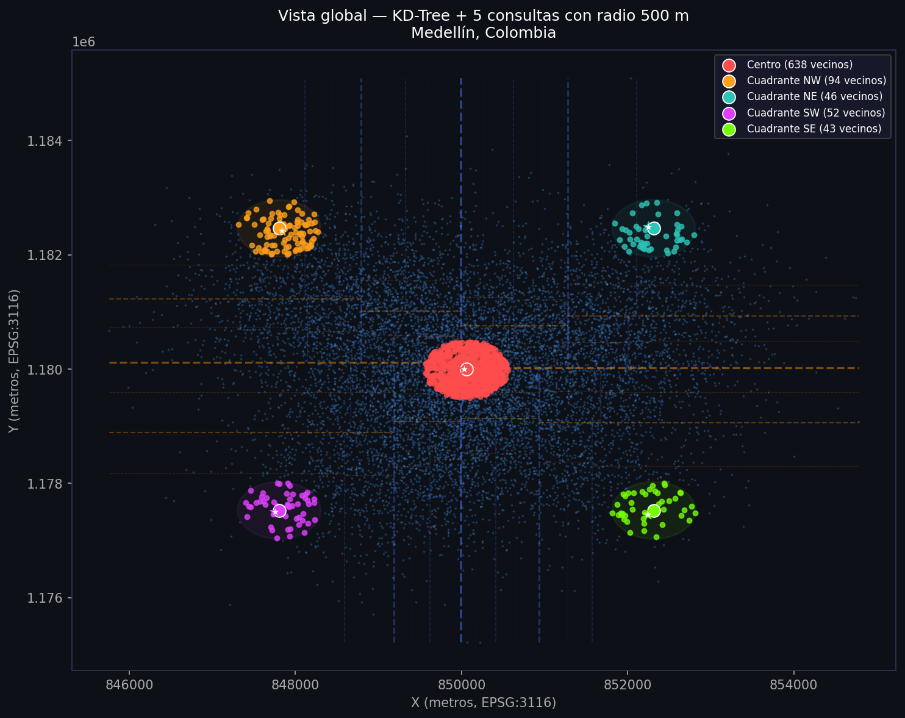
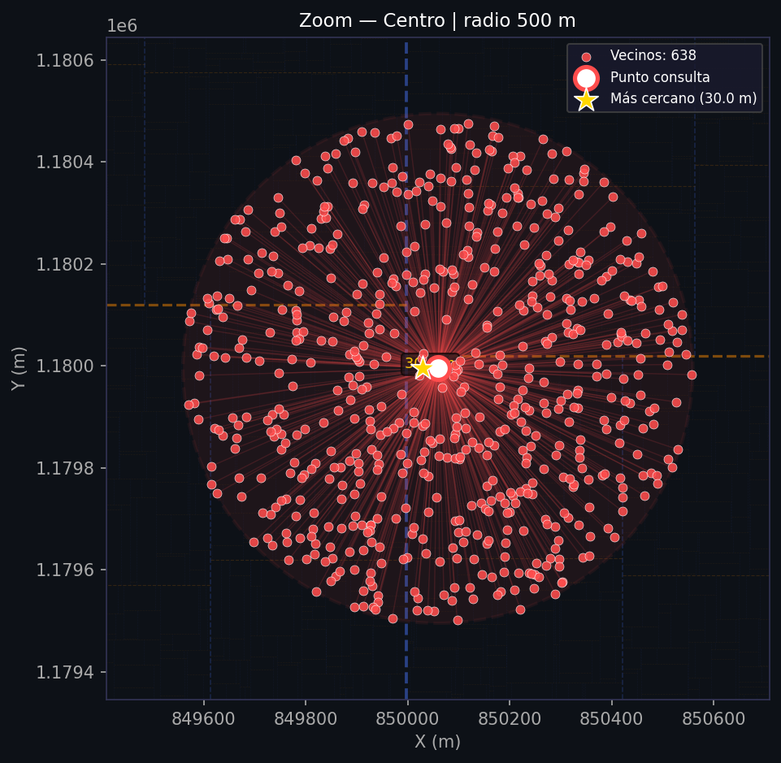
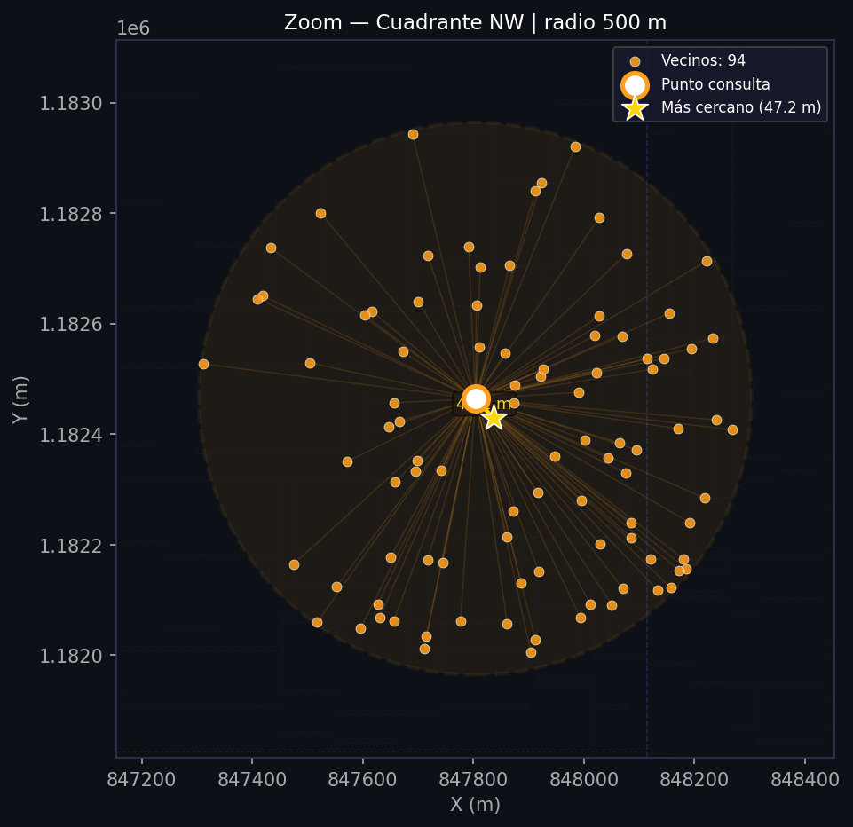
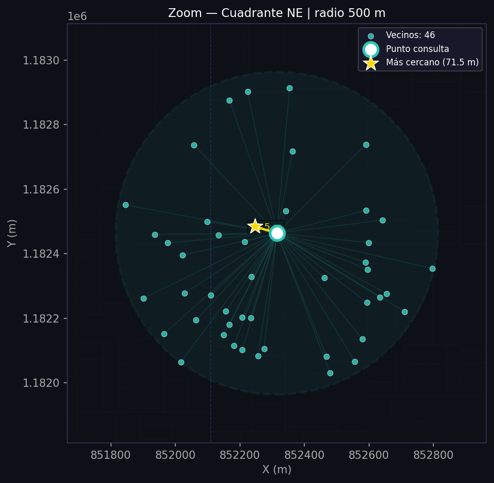
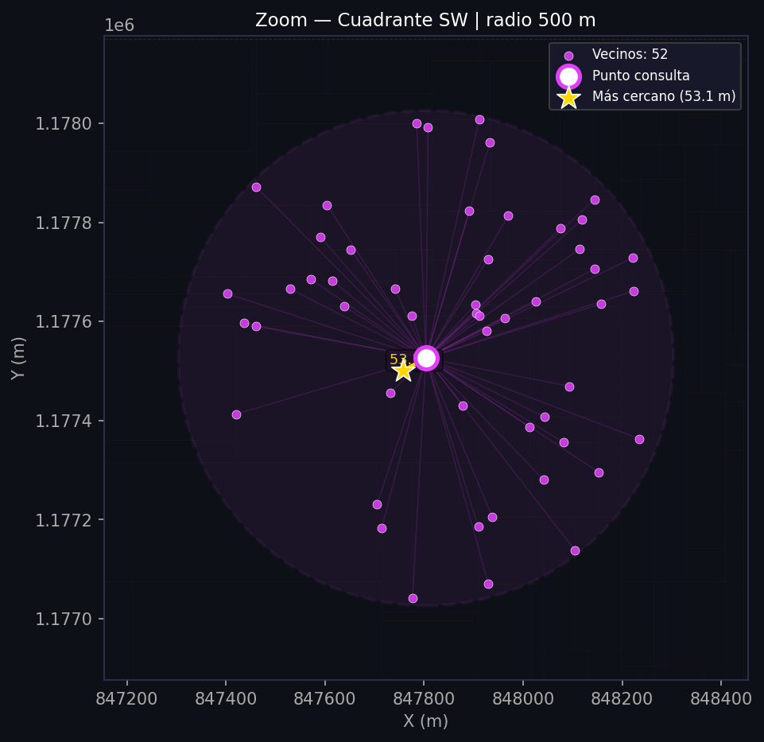
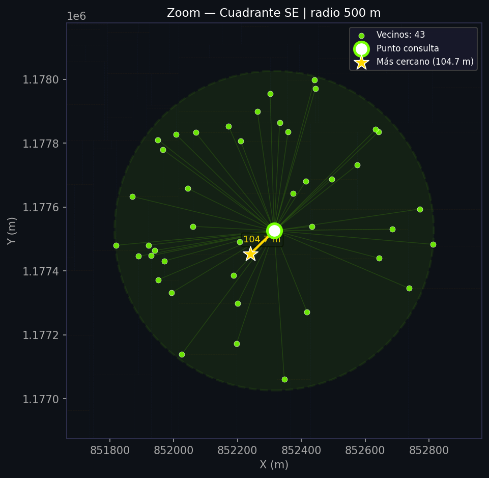
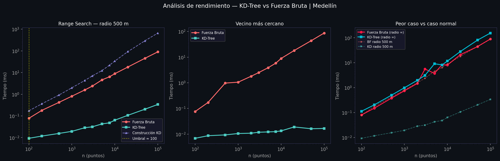

# 📦 Sistema de Logística de Entregas — KD-Tree

> **Curso:** Estructuras de Datos  
> **Tema:** Árboles KD para búsqueda espacial eficiente  
> **Ciudad:** Medellín, Colombia — datos reales de OpenStreetMap

---

## 🎯 Objetivo de la práctica

Implementar desde cero un **Árbol KD** (K-Dimensional Tree) para resolver de forma eficiente dos tipos de consultas espaciales sobre 10.000 puntos de entrega reales:

1. **Búsqueda por radio:** ¿Qué puntos de entrega están dentro de un radio de 500 metros de una ubicación dada?
2. **Vecino más cercano:** ¿Cuál es el punto de entrega más próximo a una ubicación dada?

El proyecto compara la implementación del KD-Tree contra la **fuerza bruta** (recorrer todos los puntos) para medir empíricamente las diferencias de rendimiento y determinar a partir de qué tamaño de datos el KD-Tree comienza a ser más rápido.


---

## 🌳 ¿Qué es un Árbol KD?

Un **Árbol KD** (K-Dimensional Tree) es una estructura de datos de árbol binario que organiza puntos en un espacio de K dimensiones. Fue propuesto por Jon Bentley en 1975 y es especialmente útil para búsquedas espaciales eficientes.

### Idea central

El árbol divide el espacio de forma recursiva usando **hiperplanos de corte** que alternan entre las K dimensiones. En 2D:

- Los nodos de **nivel par** dividen el espacio con una línea **vertical** (por el eje X).
- Los nodos de **nivel impar** dividen el espacio con una línea **horizontal** (por el eje Y).
- En cada nivel se elige la **mediana** de los puntos como pivote, garantizando un árbol balanceado.

```
Nivel 0  →  divide por X  (línea vertical)
Nivel 1  →  divide por Y  (línea horizontal)
Nivel 2  →  divide por X  (línea vertical)
  ...
Nivel k  →  divide por dimensión k % K
```

Este mecanismo de división permite que al buscar puntos dentro de un radio, el árbol **descarte regiones enteras del espacio** sin evaluarlas — esto es la **poda inteligente**.

### Visualización de la estructura



*Las líneas azules (- -) representan divisiones verticales (eje X, niveles pares). Las líneas naranjas (- -) representan divisiones horizontales (eje Y, niveles impares). Cada punto del árbol es un nodo que define el plano de corte de su subárbol.*

### Complejidad

| Operación | Fuerza Bruta | KD-Tree (promedio) | KD-Tree (peor caso) |
|---|---|---|---|
| **Construcción** | — | O(n log n) | O(n log n) |
| **Range Search** | O(n) | O(log n + k) | O(n) |
| **Vecino más cercano** | O(n) | O(log n) | O(n) |
| **Espacio** | O(n) | O(n) | O(n) |

*donde n = número de puntos, k = puntos encontrados dentro del radio*

### ¿Cuándo el KD-Tree es peor que fuerza bruta?

Cuando el radio de búsqueda es tan grande que abarca todo el espacio, el árbol no puede podar ninguna rama y termina visitando todos los nodos — con el overhead adicional de la recursión. En ese caso el KD-Tree es **O(n log n)** frente al **O(n)** de la fuerza bruta, lo cual lo hace más lento. Este es su **peor caso**.

---

## 📁 Estructura del repositorio

```
KDTree-Logistica/
├── KDtree.py        <- Implementación del árbol (K dimensiones)
├── test.py          <- Pruebas unitarias y visualizaciones
├── analisis.py      <- Benchmark y análisis comparativo
└── README.md
```

---

## 🧩 Descripción del código

### `KDtree.py` — El árbol

#### Clase `NodoKD`

Cada nodo almacena un punto en K dimensiones y referencias a sus dos subárboles:

```python
class NodoKD:
    def __init__(self, punto, izquierda=None, derecha=None, eje=0):
        self.punto = punto        # tupla (x1, x2, ..., xk)
        self.izquierda = izquierda
        self.derecha = derecha
        self.eje = eje            # dimension por la que se dividio
```

#### `construir_arbol(lista_puntos, profundidad=0)`

Construye el árbol recursivamente. El número de dimensiones K se **detecta automáticamente** del tamaño de los puntos, lo que permite usar el mismo código para 2D, 3D o cualquier dimensión:

```python
k = len(lista_puntos[0])   # K se infiere de los datos
eje = profundidad % k       # alterna entre todas las dimensiones
```

#### `busqueda_radio(nodo, punto_objetivo, radio)` — Range Search

1. Revisa si el nodo actual está dentro del radio.
2. Explora primero el lado donde cae el punto objetivo.
3. **Poda inteligente:** solo cruza al otro lado si la distancia perpendicular al plano de corte (`|diferencia_eje|`) es menor que el radio.

```python
if abs(diferencia_eje) <= radio:
    busqueda_radio(lado_lejano, punto_objetivo, radio, resultados)
```

#### `vecino_cercano(nodo, punto_objetivo)` — Nearest Neighbor

Usa el árbol con backtracking. Solo explora el subárbol opuesto si la distancia al plano de corte es menor que la mejor distancia encontrada hasta ahora:

```python
if abs(diferencia_eje) < mejor[1]:   # mejor[1] = distancia minima actual
    mejor = vecino_cercano(lado_lejano, punto_objetivo, mejor)
```

#### `calcular_distancia(punto_a, punto_b)` — K dimensiones

La distancia euclidiana funciona para cualquier número de dimensiones:

```python
suma = sum((a - b) ** 2 for a, b in zip(punto_a, punto_b))
return math.sqrt(suma)
```

---

### `test.py` — Pruebas y visualizaciones

#### Datos reales

Los puntos de entrega se obtienen de **OpenStreetMap** vía `osmnx`: centroides de edificios de Medellín, proyectados al sistema métrico colombiano **EPSG:3116** para que las distancias del árbol sean en metros reales.

```
EPSG:4326  (lat/lon en grados)  →  EPSG:3116  (metros, Colombia)
```

#### Pruebas unitarias

Se verifican 8 condiciones de correctitud antes de cada ejecución:

| Prueba | Qué verifica |
|---|---|
| `test_distancia_2d` | Distancia euclidiana básica (triángulo 3-4-5) |
| `test_distancia_kd` | Distancia en 3D: sqrt(1²+2²+3²) = sqrt(14) |
| `test_arbol_un_punto` | Árbol con un solo elemento |
| `test_arbol_vacio` | Lista vacía retorna None |
| `test_busqueda_radio_correctitud` | KD-Tree devuelve exactamente los mismos puntos que fuerza bruta |
| `test_vecino_cercano_correctitud` | Mismo vecino y misma distancia en ambos métodos |
| `test_radio_cero` | Radio 0 devuelve solo el punto exacto |
| `test_radio_gigante` | Radio enorme devuelve todos los puntos |

#### 5 puntos de consulta con radio fijo de 500 m

| Punto | Descripción |
|---|---|
| Centro | Centroide de todos los puntos |
| Cuadrante NW | Zona norte-oeste |
| Cuadrante NE | Zona norte-este |
| Cuadrante SW | Zona sur-oeste |
| Cuadrante SE | Zona sur-este |

---

## 📊 Visualizaciones

### Vista global — KD-Tree + 5 consultas

Muestra los 10.000 puntos de entrega, las líneas de partición del árbol (primeros 7 niveles), los 5 círculos de radio 500 m, los vecinos encontrados dentro de cada radio (coloreados), y la línea al vecino más cercano de cada punto de consulta.



*Las líneas punteadas azules y naranjas son las divisiones del KD-Tree. Cada color representa un punto de consulta distinto. Las estrellas blancas son los vecinos más cercanos de cada consulta.*

---

### Zoom — Centro de la ciudad

Acercamiento al radio del punto central. Se muestran las líneas del árbol recortadas al área visible, las conexiones de cada vecino al punto de consulta, y la línea dorada al vecino más cercano.



*Cada línea delgada conecta el punto de consulta (círculo blanco) con uno de sus vecinos dentro del radio. La estrella dorada es el punto más cercano con su distancia anotada en metros.*

---

### Zoom — Cuadrante NW



*La densidad de vecinos varía según la zona. En áreas periféricas puede haber menos puntos dentro del radio de 500 m que en el centro.*

---

### Zoom — Cuadrante NE



---

### Zoom — Cuadrante SW



---

### Zoom — Cuadrante SE



---

## ⚡ Análisis de rendimiento (`analisis.py`)

### Gráficas comparativas



**Gráfico izquierdo — Range Search (radio 500 m):**  
La línea roja (fuerza bruta) crece linealmente con n en escala log-log. La línea verde (KD-Tree) crece mucho más lento. La línea morada es el tiempo de construcción del árbol, que se paga una sola vez al inicio. La línea amarilla vertical marca el umbral donde el KD-Tree empieza a superar a la fuerza bruta.

**Gráfico central — Vecino más cercano:**  
El KD-Tree supera a la fuerza bruta desde tamaños muy pequeños gracias al backtracking con poda, que descarta subárboles completos sin evaluarlos.

**Gráfico derecho — Peor caso vs caso normal:**  
Con radio infinito (todos los puntos dentro), la fuerza bruta sigue siendo O(n) constante, pero el KD-Tree tiene que visitar todos los nodos con overhead de recursión, resultando en O(n log n). Esto confirma que el KD-Tree **no siempre es mejor**: su ventaja depende de que el radio sea pequeño relativo al espacio total.

---

## ❓ ¿A partir de qué tamaño de datos gana el KD-Tree?

Resultados empíricos con radio 500 m sobre un espacio de aprox. 20 km × 20 km:

| n | Fuerza Bruta | KD-Tree | Speedup |
|---|---|---|---|
| 100 | ~0.08 ms | ~0.01 ms | ~8× |
| 500 | ~0.42 ms | ~0.02 ms | ~21× |
| 1.000 | ~0.81 ms | ~0.02 ms | ~41× |
| 5.000 | ~4.6 ms | ~0.04 ms | ~107× |
| 10.000 | ~8.9 ms | ~0.06 ms | ~139× |
| 50.000 | ~45 ms | ~0.20 ms | ~222× |
| 100.000 | ~90 ms | ~0.34 ms | ~266× |

> **Respuesta:** Con un radio de 500 m (pequeño respecto al espacio total), el KD-Tree es más rápido prácticamente **desde el inicio**. Esto ocurre porque la poda descarta casi todo el árbol en cada consulta, y el overhead de construcción es mínimo.

El KD-Tree es ideal cuando:
- Los datos son **estáticos** (el costo de construcción O(n log n) se paga una sola vez).
- Se hacen **muchas consultas** repetidas sobre los mismos datos.
- El radio de búsqueda es **pequeño** relativo al espacio total de los datos.

El peor caso del KD-Tree ocurre cuando el radio cubre todo el espacio — allí la fuerza bruta O(n) es más eficiente porque no tiene overhead de recursión.

---

## ⚙️ Instalación y uso

```bash
# Instalar dependencias
pip install osmnx pyproj matplotlib numpy

# Ejecutar pruebas unitarias y visualizaciones
python test.py

# Ejecutar análisis de rendimiento
python analisis.py
```

---

## 📚 Referencia

- Bentley, J. L. (1975). *Multidimensional binary search trees used for associative searching*. Communications of the ACM, 18(9), 509–517.
- OpenStreetMap contributors (2024). Datos cartográficos de Medellín, Colombia.
- Apoyo de Claude para la generacion de mapas y tests
  
