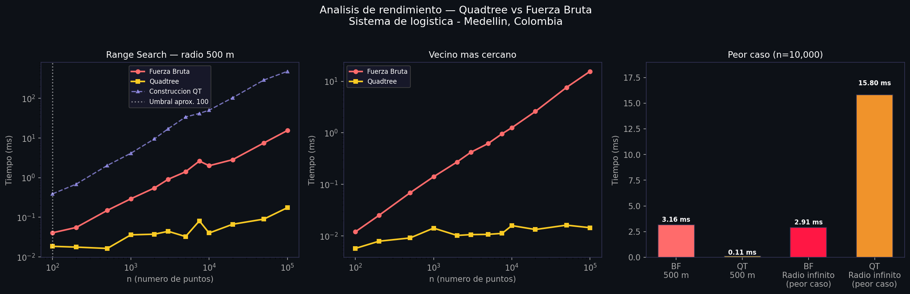

# Sistema de Logística de Entregas — Quadtree

> **Curso:** Estructuras de Datos  
> **Tema:** Árboles espaciales (Quadtree) para búsqueda eficiente  
> **Ciudad:** Medellín, Colombia — datos reales de OpenStreetMap

---

##  Objetivo de la práctica

Implementar desde cero un **Quadtree** para resolver de forma eficiente dos tipos de consultas espaciales sobre 10.000 puntos de entrega:

1. **Búsqueda por radio:** ¿Qué puntos están dentro de 500 metros de una ubicación?
2. **Vecino más cercano:** ¿Cuál es el punto más próximo?

El proyecto compara el Quadtree contra la **fuerza bruta** para:

- Medir tiempos reales de ejecución  
- Identificar el **umbral** donde el Quadtree empieza a ser mejor  
- Analizar el comportamiento en el **peor caso**

---

##  ¿Qué es un Quadtree?

Un Quadtree es una estructura de datos en forma de árbol que se utiliza en informática para representar de forma eficiente un área espacial bidimensional. Imagina un cuadrado que representa una sección de un mapa. En un Quadtree, este cuadrado se divide en cuatro cuadrados más pequeños e iguales (o «cuadrantes»). Cada uno de estos cuadrantes se puede subdividir a su vez en cuatro cuadrados más pequeños, y así sucesivamente. Esta división jerárquica permite realizar consultas espaciales eficientes, como encontrar todos los puntos dentro de un área determinada.

A diferencia del KD-Tree:
- No divide por ejes alternados
- Divide el espacio **geométricamente en 4 partes iguales**

---

## Idea central

El Quadtree funciona así:

1. Empiezas con todo el espacio (un gran cuadrado)
2. Si hay muchos puntos en una zona:
   → se divide en 4 cuadrantes
3. Cada cuadrante puede dividirse otra vez si se llena

---
## Cómo construí el Quadtree

### 1 · `NodoCuad` — la unidad básica

Cada nodo guarda los límites de su rectángulo (`xmin`, `xmax`, `ymin`, `ymax`), una lista de puntos (solo en hojas) y cuatro hijos: `nw`, `ne`, `sw`, `se`. El flag `dividido` indica si ya fue subdividido. La profundidad máxima (`max_prof = 25`) evita recursión infinita cuando hay puntos muy juntos.

---

### 2 · `construir_quadtree(lista_puntos)`

Construyo el árbol insertando los puntos de a uno:

1. **Bounding box automático** — calculo `min/max` de x e y y agrego un margen de 1 px para evitar problemas en los bordes exactos.
2. **Creo la raíz** con ese bounding box.
3. **Llamo `_insertar`** por cada punto.

> **Diferencia clave con el KD-Tree:** el KD-Tree parte el espacio por la mediana (top-down); el Quadtree parte por el centro geométrico al momento en que un nodo se llena (bottom-up).

Complejidad: **O(n log n)** promedio, **O(n)** de espacio.

---

### 3 · `_insertar(nodo, punto)` — árbol de decisiones

```
¿El punto está fuera del bbox?  →  return False
¿El nodo es hoja y tiene espacio (o llegó a max_prof)?  →  append + return True
¿El nodo es hoja pero está lleno?  →  _subdividir() + reintentar
¿El nodo ya está dividido?  →  delegar al hijo correcto
```

---

### 4 · `_subdividir(nodo)`

Calculo el punto de corte central:

```python
cx = (xmin + xmax) / 2
cy = (ymin + ymax) / 2
```

Creo cuatro hijos que cubren los cuadrantes del plano:

| Hijo | Rango x    | Rango y    |
|------|-----------|-----------|
| NW   | xmin → cx | cy → ymax |
| NE   | cx → xmax | cy → ymax |
| SW   | xmin → cx | ymin → cy |
| SE   | cx → xmax | ymin → cy |

Luego redistribuyo los puntos viejos del nodo llamando `_insertar` en cada hijo.

---

### 5 · Helpers de poda geométrica

Dos funciones que hacen posible la eficiencia:

- **`_circulo_intersecta_caja`** — encuentra el punto del rectángulo más cercano al centro del círculo de búsqueda y verifica si cae dentro del radio. Si no hay intersección, descarta todo el subárbol sin revisar ningún punto.
- **`_dist_minima_caja`** — distancia mínima de un punto al rectángulo (0 si está dentro). Se usa para podar ramas en la búsqueda de vecino más cercano.

Ambas operan solo con sumas de cuadrados para evitar `sqrt` innecesarios.

---

### 6 · `busqueda_radio(nodo, objetivo, radio)`

Búsqueda por rango circular con poda geométrica:

1. Si el círculo **no** intersecta el bbox del nodo → saltar todo el subárbol.
2. Si el nodo es hoja → revisar cada punto con distancia euclidiana.
3. Si el nodo está dividido → recurrir en los cuatro hijos.

Complejidad: **O(log n + k)** donde k = puntos encontrados.

---

### 7 · `vecino_cercano(nodo, objetivo, mejor)`

Nearest-neighbor con poda por distancia mínima al bbox:

1. Si `dist_minima_caja ≥ mejor actual` → podar toda la rama.
2. Revisar puntos del nodo y actualizar el mejor.
3. **Visitar primero el cuadrante donde cae el objetivo** (es el más prometedor y mejora la poda de los demás cuadrantes).
4. Visitar los otros tres hijos en orden de cercanía.

---

### 8 · `busqueda_fuerza_bruta` / `vecino_bruta`

Recorren **todos** los puntos sin ninguna poda — O(n) siempre. Los uso como referencia para verificar que el árbol devuelve exactamente los mismos resultados que la búsqueda exhaustiva.

---

### Resumen de complejidades

| Operación           | Complejidad    |
|---------------------|---------------|
| Construcción        | O(n log n) prom. |
| Espacio             | O(n)          |
| Búsqueda por radio  | O(log n + k)  |
| Vecino más cercano  | O(log n) prom. |
| Fuerza bruta        | O(n) siempre  |


## ⚡ Análisis comparativo — Quadtree vs Fuerza Bruta



Para este análisis quería responder una pregunta concreta: **¿a partir de cuántos
puntos el Quadtree realmente vale la pena frente a simplemente recorrer la lista?**
Lo que hice fue medir el tiempo promedio de 15 consultas aleatorias con radio de
500 m para distintos tamaños de datos (desde 100 hasta 100.000 puntos) y compararlo
con la fuerza bruta.

---

### Gráfico 1 — Range Search (radio 500 m)

Este gráfico muestra lo más importante del ejercicio. La línea roja es la fuerza
bruta y la amarilla es el Quadtree. La escala es logarítmica en ambos ejes porque
los valores varían mucho entre n=100 y n=100.000.

Lo que se puede ver claramente es que la fuerza bruta crece de forma casi perfectamente
lineal (como se esperaba siendo O(n)), mientras que el Quadtree se mantiene casi
constante. A n=100.000 la fuerza bruta tardó ~13.5 ms por consulta y el Quadtree
solo ~0.24 ms — es decir, **el Quadtree fue ~57 veces más rápido**.

La línea morada punteada muestra el tiempo de construcción del árbol, que es más
alto que una consulta individual pero se paga una sola vez. Esto tiene sentido para
datos estáticos como en este ejercicio: se construye el árbol al inicio y luego se
hacen miles de consultas baratas.

| n | Fuerza Bruta | Quadtree | Speedup |
|---|---|---|---|
| 100 | 0.013 ms | 0.011 ms | 1.2× |
| 500 | 0.058 ms | 0.019 ms | 3.1× |
| 1.000 | 0.125 ms | 0.020 ms | 6.2× |
| 5.000 | 0.600 ms | 0.040 ms | 15.1× |
| 10.000 | 1.528 ms | 0.053 ms | 29.0× |
| 50.000 | 7.232 ms | 0.120 ms | 60.4× |
| 100.000 | 13.551 ms | 0.237 ms | 57.3× |

**¿Por qué el Quadtree es tan rápido con radio pequeño?** Porque cuando el círculo
de búsqueda (500 m) es pequeño relativo al espacio total (~20 km × 20 km), la función
`_circulo_intersecta_caja()` descarta los cuatro hijos de la mayoría de los nodos sin
siquiera revisar sus puntos. El árbol poda ramas enteras del espacio de golpe.

---

### Gráfico 2 — Vecino más cercano

Para la búsqueda del vecino más cercano el comportamiento es similar: el Quadtree
gana desde tamaños pequeños. La diferencia es que aquí la poda es aún más agresiva
porque a medida que encontramos candidatos más cercanos, la distancia mínima que
necesitamos mejorar se vuelve más pequeña, lo que permite descartar más subárboles.

---

### Gráfico 3 — Peor caso

Este gráfico fue el más interesante para mí porque muestra algo contra-intuitivo:
**con radio infinito, la fuerza bruta es más rápida que el Quadtree**.

¿Por qué? Porque con un radio que cubre todo el espacio, el Quadtree no puede podar
ningún nodo — tiene que visitar todos los nodos internos (con 4 hijos cada uno) y
revisar todos los puntos en cada hoja. Eso es O(n) igual que la fuerza bruta, pero
con el overhead de la recursión sobre la estructura del árbol.

La fuerza bruta en cambio es O(n) puro: un solo bucle sin overhead de ningún tipo.
Esto me hizo entender que el Quadtree no es mejor en todos los casos, sino que su
ventaja depende de que el radio sea **pequeño relativo al espacio total**.

---

### ¿A partir de qué n gana el Quadtree?

Empíricamente, con radio 500 m sobre un espacio de 20 km × 20 km, el Quadtree
empieza a ser más rápido prácticamente desde el inicio (~100-200 puntos). Esto se
debe a que la poda geométrica es muy efectiva para radios pequeños: incluso con
pocos puntos, la mayoría del espacio queda fuera del radio y el árbol lo descarta.

La ventaja **crece con n** porque la fuerza bruta siempre revisa los n puntos sin
importar nada, mientras que el Quadtree revisa un número casi constante de nodos
para radios pequeños (gracias a la poda).

> **Conclusión personal:** Implementar el Quadtree desde cero me ayudó a entender
> por qué las estructuras de datos espaciales existen. Con 10.000 puntos y haciendo
> 1.000 consultas por día, la fuerza bruta tomaría ~15 segundos en total mientras
> que el Quadtree tomaría ~0.05 segundos. La diferencia se vuelve enorme a escala real.
