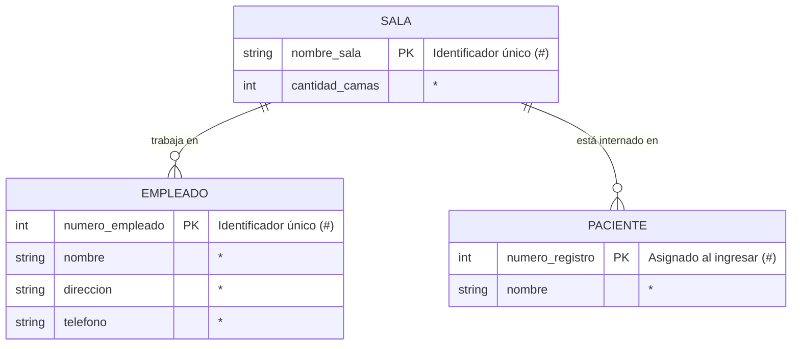

# Estructura-de-datos-UDEA
# Ejercicio: Modelo Entidad-Relación 

Este repositorio contiene la solución del ejercicio de modelado de datos para un sistema hospitalario, utilizando la **Notación de Barker**.

## 1. Diagrama Entidad-Relación

## 2. Diccionario de Datos

| Entidad | Atributo | Tipo | Descripción |
| :--- | :--- | :--- | :--- |
| **SALA** | nombre_sala | PK (#) | Nombre único que identifica la sala. |
| | cantidad_camas | Mandatory (*) | Capacidad total de la sala. |
| **EMPLEADO** | numero_empleado | PK (#) | Código único de trabajador. |
| | nombre, dirección, tel | Mandatory (*) | Datos de contacto y personales. |
| **PACIENTE** | numero_registro | PK (#) | ID generado al ingreso del paciente. |
